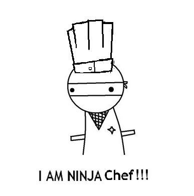

# Chef, CentOS, and our new servers

!SLIDE

# Chef, CentOS, and our new servers
## Trae Robrock (@trobrock)

!SLIDE

# What is Chef?

* Automated configuration management system

!SLIDE

# Why do we use it?

* Consistent server configuration
* It's all in git
* Minimize access to servers

!SLIDE

# Overview of our chef repo

[The kitchen](https://github.com/outright/kitchen)

!SLIDE

# Why CentOS, what are the differences?

* GoDaddy does it...
* More of a focus on security
* yum vs. apt
* rpm vs. deb

!SLIDE

# What's new on our servers

* Chef
* CentOS
* Bluepill instead of God
* Percona instead of MySQL

!SLIDE

# Vagrant overview
### DEMO

!SLIDE

# Questions?
